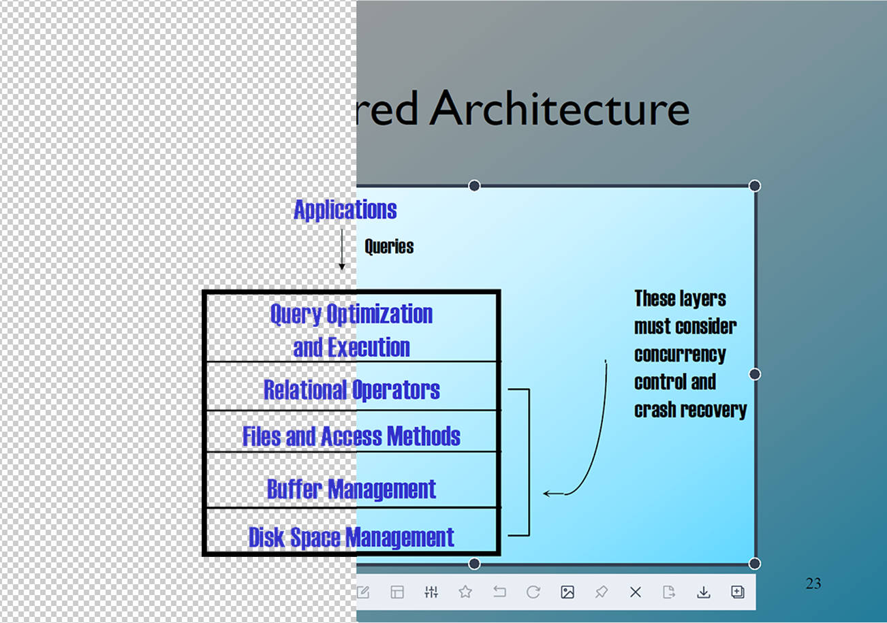
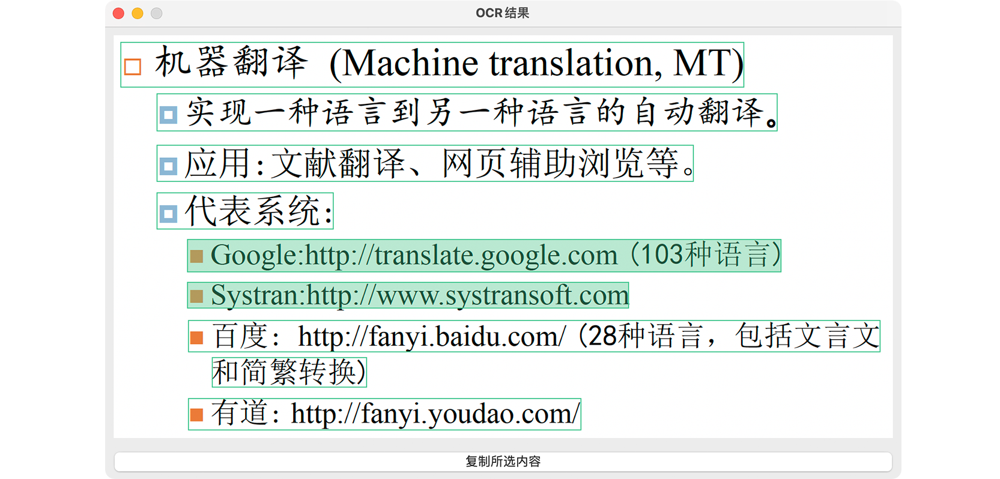
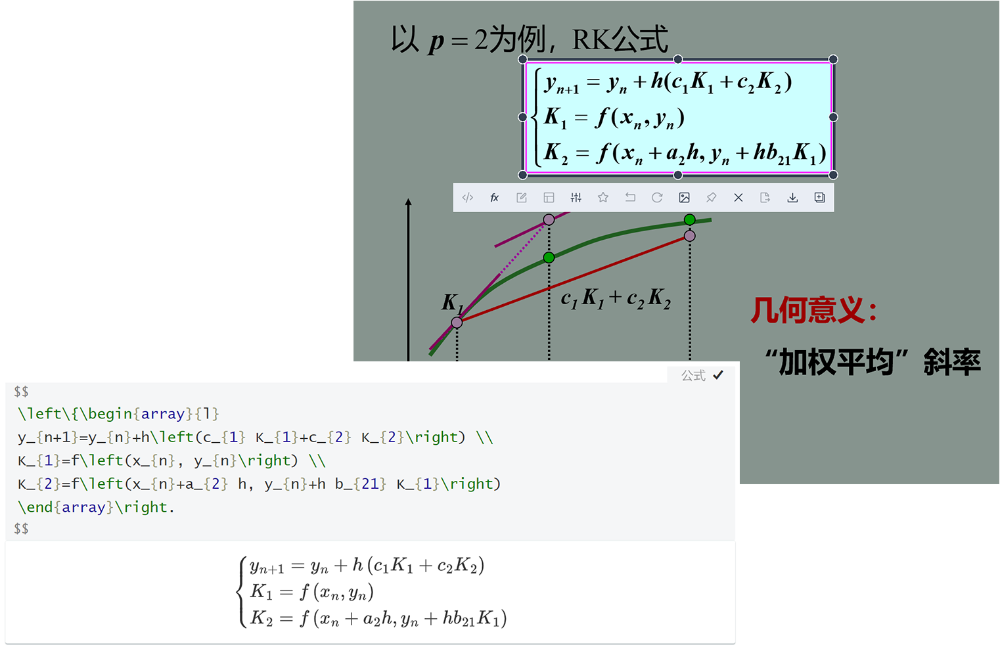

> Access [Space product page](http://foldimension.tech/#/) for more interactive experience.
### Background Removal
Space can remove the background in the courseware (PPT etc.), making it easier to unify the style of notes.

### Smart OCR
Space will automatically detect whether the text content belongs to the same paragraph, simplifying user operations as much as possible. When the content does not belong to the same paragraph, Space provides an efficient candidate window.

### LaTeX Formula Extraction
Formulas are another type of items that appear frequently in courseware. 
Space can quickly extract the LaTeX code corresponding to the formula for easy reproduction.

