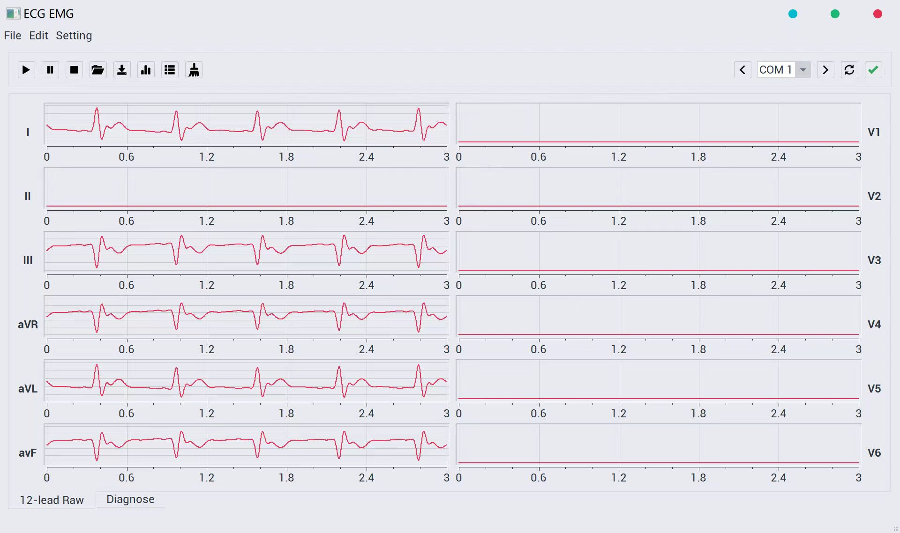

This project includes using Altum Designer to draw PCB, writing UART communication programs, and developing software based on QT for ECG signal analysis, recording and visualization.

### PCB Design
The PCB is drawn with Altum Designer.
It contains two chips, STM32 and ADS1298, a low-noise analog-to-digital converter for EEGand Biopotential Measurements.
It interacts with the host computer through the UART protocol and can store data in a TF card.

### Software
The analysis software can display up to 12 channels of waveforms.
Since ECG signals are very easy to be interfered, I implements the heap-based median filter and the 50Hz band-stop filter.

