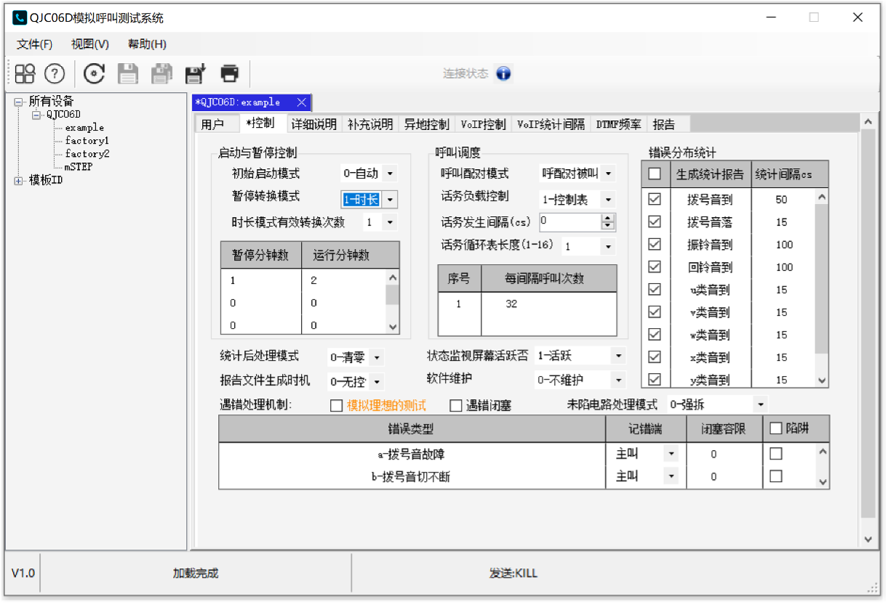
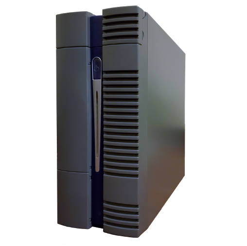

This project builds a product-level bulk call generator QJC06D. In the project I am responsible for the design of a analysis software based on C# and .Net framework.

### QJC06D Machine
The QJC06D series bulk call simulation test system uses the program-controlled switch user circuit interface to simulate telephone user behavior, exert pressure on the switch, and provide statistical reports for monitoring and testing the switch's response, thereby helping testers to test system for analyzing the comprehensive performance of switches.
The application of the QJC06D series bulk call simulation test system runs through all aspects of the development, production, measurement inspection and actual maintenance of program-controlled switches.

